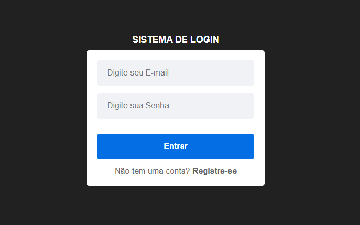
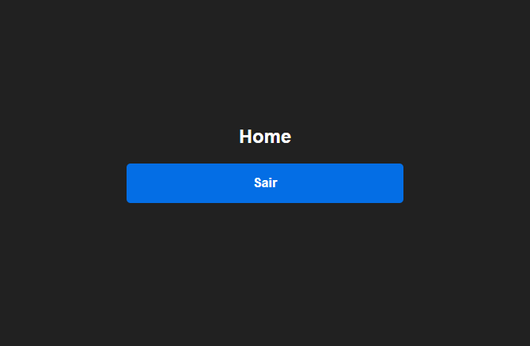

# Sistema de Login

<!-- 
 -->

Este é um projeto simples de um Sistema de Login realizado em ReactJS contendo Autenticação, Context API, e Hooks.
  

## Funcionalidades

- **Login de usuário**: Permite que o usuário entre no sistema utilizando E-mail de usuário e senha. 
- **Registro de usuário**: Usuários podem se cadastrar criando um novo perfil.  
- **Mensagens de erro**: Exibe mensagens claras ao usuário em caso de falha na autenticação ou campos obrigatórios não preenchidos.  

Deploy: 

  
  Tecnologia usadas:      
  
  
  
  

